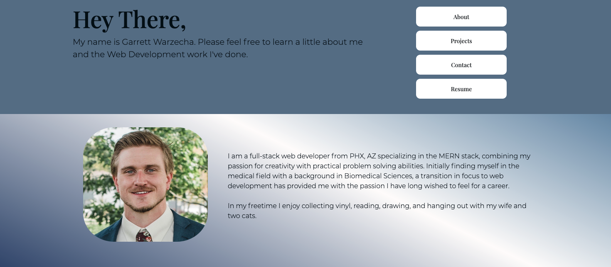

  # Professional React Portfolio
  

  ## Description: 

  A portfolio created using mainly React and Bootsrap for potential employers and those interested in my work to view.

  
  

   

  ## Built With: 

  This portfolio was primarily built using `React.js` and `Bootstrap`. I also utilized `react-feather` for icons, `Coolors` for font-palette inspiration, and StackOverflow for some collective help from the coding community when I would become stuck on a particular bit of code.

  ## Deployed Site:
  
  https://gwarzecha.github.io/react-portfolio/

  
  ## Questions?:
  * <a href="https://github.com/gwarzecha" target="_blank">GitHub</a>
  * <a href="mailto: gmwarzecha@gmail.com" target="_blank">Email</a>
  
  ## License: 

  This project is covered under the MIT license.

